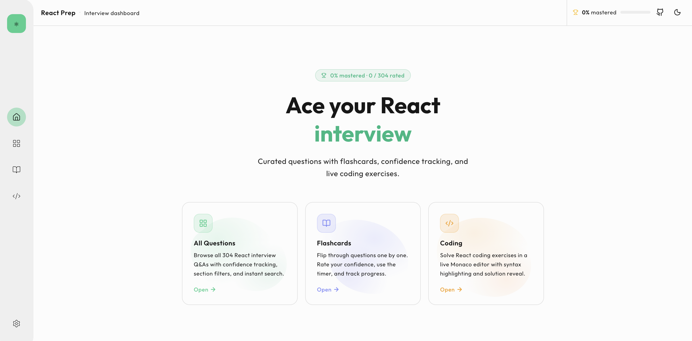

# ⚛️ React Prep
### *The Ultimate Interview Dashboard for Modern React Developers*

<div align="center">
  
  <p><i>A sleek, data-driven platform to bridge the gap between "knowing" React and "acing" the interview.</i></p>
</div>

---

## ✨ Overview
**React Prep** is a hobby project designed to streamline the interview preparation process. Instead of jumping between scattered blog posts and documentation, this dashboard centralizes your study workflow with active recall and hands-on practice.

### 🎯 Key Modules
* **📚 All Questions:** Browse **304 curated React Q&As** with instant search and section filters.
* **🗂️ Flashcards:** Master active recall. Flip questions, rate your confidence, and track your mastery over time.
* **📊 Mastery Tracking:** A global progress system that visualizes your readiness across all topics.

---

## 🛠️ Technical Stack

| Category | Tech |
| :--- | :--- |
| **Frontend** | React.js (Vite) |
| **Styling** | Tailwind CSS |
| **Editor** | ---- |
| **Icons** | Lucide React |
| **State** | [Add your state management here, e.g., Zustand/Context] |

---

## 🚦 Getting Started

### Prerequisites
* Node.js (v18.0 or higher)
* npm / yarn / pnpm

### Installation
1.  **Clone the repository:**
    ```bash
    git clone [https://github.com/Zer0-XD/frontend-prep-nextjs.git](https://github.com/Zer0-XD/frontend-prep-nextjs.git)
    cd react-prep
    ```

2.  **Install dependencies:**
    ```bash
    npm install
    ```

3.  **Launch the dashboard:**
    ```bash
    npm run dev
    ```

---

## 📝 Roadmap
- [ ] **Dark Mode:** Fully implement the theme switcher seen in the UI.
- [ ] **Custom Questions:** Allow users to add their own study notes.
- [ ] **Mock Mode:** A timed "exam" mode that pulls 10 random questions.
- [ ] **Mobile Optimization:** Ensure the Monaco editor is responsive for tablet study.
- [ ] **Leetcode style editor:** .

---

## 🤝 Contributing
This is a hobby project, but suggestions are always welcome! Feel free to fork the repo and submit a PR.
